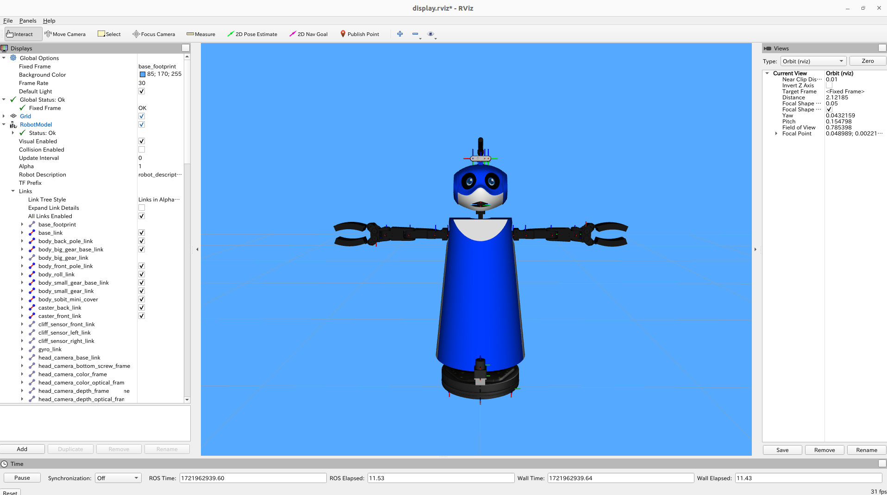

<a name="readme-top"></a>

[JA](README.md) | [EN](README.en.md)

[![Contributors][contributors-shield]][contributors-url]
[![Forks][forks-shield]][forks-url]
[![Stargazers][stars-shield]][stars-url]
[![Issues][issues-shield]][issues-url]
[![License][license-shield]][license-url]

# SOBIT MINI Gazebo

<!--TABLE OF CONTENTS-->
<details>
   <summary>Table of Contents</summary>
   <ol>
    <li>
      <a href="#introduction">Introduction</a>
    </li>
    <li>
      <a href="#getting-started">Getting Started</a>
      <ul>
        <li><a href="#prerequisites">Prerequisites</a></li>
        <li><a href="#installation">Installation</a></li>
      </ul>
    </li>
    <li>
    <a href="#launch-and-usage">Launch and Usage</a>
      <ul>
        <li><a href="#visualization-on-rviz">Visualization on Rviz</a></li>
      </ul>
    </li>
    <li><a href="#gazebo-world-changes">Gazebo World Changes</a></li>
    <li><a href="#milestone">Milestone</a></li>
    <li><a href="#references">References</a></li>
   </ol>
</details>

<!--Introduction to the Repository-->
## Introduction


This is a library for running the SOBITS dual-arm mobile manipulator (SOBIT MINI) developed by SOBITS on gazebo.

<p align="right">(<a href="#readme-top">Back to top</a>)</p>


<!-- Getting Started -->
## Getting Started

This section describes how to set up this repository.
<p align="right">(<a href="#readme-top">Back to top</a>)</p>


### Prerequisites

First, please prepare the following environment before proceeding to the next installation stage.

| System  | Version |
| ------------- | ------------- |
| Ubuntu | 20.04 (Focal Fossa) |
| ROS | Noetic Ninjemys |
| Python | 3.0~ |

> [!NOTE]
> For information on how to install `Ubuntu` or `ROS`, please refer to the [SOBIT Manual](https://github.com/TeamSOBITS/sobits_manual#%E9%96%8B%E7%99%BA%E7%92%B0%E5%A2%83%E3%81%AB%E3%81%A4%E3%81%84%E3%81%A6).

<p align="right">(<a href="#readme-top">Back to top</a>)</p>


### Installation

> [!WARNING]
> This repository assumes that [sobit_mini](https://github.com/TeamSOBITS/sobit_mini.git) is already installed.

1. Go to the `src` folder of ROS.
   ```sh
   $ roscd
   # Or go to “cd ~/catkin_ws/”.
   $ cd src/
   ```
2. Clone this repository.
   ```sh
   $ git clone https://github.com/TeamSOBITS/sobit_mini_gazebo
   ```
3. Go to the repository.
   ```sh
   $ cd sobit_mini_gazebo/
   ```
4. Install dependent packages.
   ```sh
   $ bash install.sh
   ```
5. Compile the package.
   ```sh
   $ roscd
   # Or go to “cd ~/catkin_ws/”.
   $ catkin_make
   ```

<p align="right">(<a href="#readme-top">Back to top</a>)</p>


<!-- Launch and Usage -->
## Launch and Usage

1. Launch the launch file named [sobit_mini_gazebo.launch](sobit_mini_gazebo/sobit_mini_gazebo/launch/sobit_mini_gazebo.launch).
   ```sh
   $ roslaunch sobit_mini_gazebo sobit_mini_gazebo.launch
   ```
2. [Optional] Let's run the demo program.
   ```sh
   $ rosrun sobit_mini_library test_control_wheel.py
   ```

> [!NOTE]
> To get familiar with how SOBIT MINI works, check the [examples](sobit_mini_library/example/) folder and learn the [motion functions](https://github.com/TeamSOBITS/sobit_mini.git) from each sample file.

<p align="right">(<a href="#readme-top">Back to top</a>)</p>


### Visualization on Rviz

Visualize SOBIT MINI on Rviz to display the robot's configuration.

```sh
$ roslaunch sobit_mini_gazebo display.launch
```

If it works correctly, Rviz will be displayed as follows.



<p align="right">(<a href="#readme-top">Back to top</a>)</p>


<!-- Gazebo World Changes -->
## Gazebo World Changes

Change the path of world_name in [sobit_mini_gazebo.launch](launch/sobit_mini_gazebo.launch)
```xml
<arg name="world_name" value="$(find your_file_path)/file.(world or sdf)"/>
```

<p align="right">(<a href="#readme-top">Back to top</a>)</p>


<!-- Milestone -->
## Milestone

- [x] OSS
    - [x] Enhanced documentation
    - [x] Unified coding style

Please visit [Issue page][issues-url] to see the current bag and new feature requests.

<p align="right">(<a href="#readme-top">Back to top</a>)</p>

<!-- References -->
## References

* [ROS Noetic](http://wiki.ros.org/noetic)
* [ROS Control](http://wiki.ros.org/ros_control)
* [SOBIT MINI](https://github.com/TeamSOBITS/sobit_mini)


<!-- MARKDOWN LINKS & IMAGES -->
<!-- https://www.markdownguide.org/basic-syntax/#reference-style-links -->
[contributors-shield]: https://img.shields.io/github/contributors/TeamSOBITS/sobit_mini_gazebo.svg?style=for-the-badge
[contributors-url]: https://github.com/TeamSOBITS/sobit_mini_gazebo/graphs/contributors
[forks-shield]: https://img.shields.io/github/forks/TeamSOBITS/sobit_mini_gazebo.svg?style=for-the-badge
[forks-url]: https://github.com/TeamSOBITS/sobit_mini_gazebo/network/members
[stars-shield]: https://img.shields.io/github/stars/TeamSOBITS/sobit_mini_gazebo.svg?style=for-the-badge
[stars-url]: https://github.com/TeamSOBITS/sobit_mini_gazebo/stargazers
[issues-shield]: https://img.shields.io/github/issues/TeamSOBITS/sobit_mini_gazebo.svg?style=for-the-badge
[issues-url]: https://github.com/TeamSOBITS/sobit_mini_gazebo/issues
[license-shield]: https://img.shields.io/github/license/TeamSOBITS/sobit_mini_gazebo.svg?style=for-the-badge
[license-url]: LICENSE
