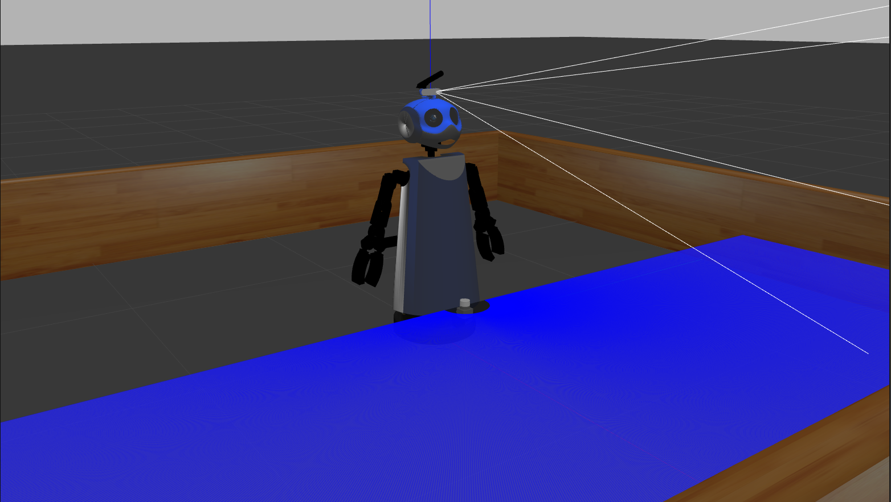
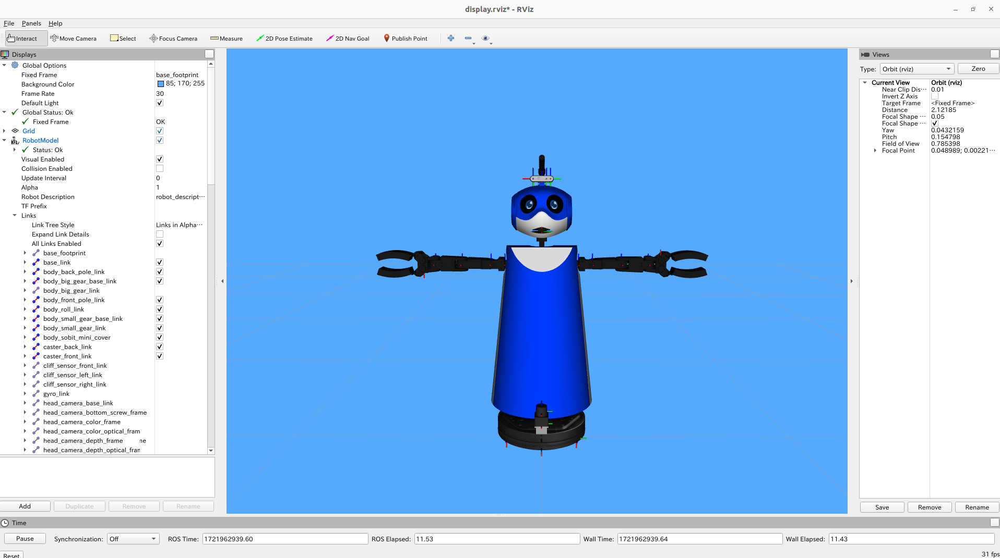

<a name="readme-top"></a>

[JA](README.md) | [EN](README.en.md)

[![Contributors][contributors-shield]][contributors-url]
[![Forks][forks-shield]][forks-url]
[![Stargazers][stars-shield]][stars-url]
[![Issues][issues-shield]][issues-url]
[![License][license-shield]][license-url]

# SOBIT MINI

<!--目次-->
<details>
   <summary>目次</summary>
   <ol>
    <li>
      <a href="#概要">概要</a>
    </li>
    <li>
      <a href="#環境構築">環境構築</a>
      <ul>
        <li><a href="#環境条件">環境条件</a></li>
        <li><a href="#インストール方法">インストール方法</a></li>
      </ul>
    </li>
    <li>
    <a href="#実行操作方法">実行・操作方法</a>
      <ul>
        <li><a href="#Rviz上の可視化">Rviz上の可視化</a></li>
      </ul>
    </li>
    <li><a href="#gazebo-worldの変更">Gazebo Worldの変更</a></li>
    <li><a href="#マイルストーン">マイルストーン</a></li>
    <li><a href="#参考文献">参考文献</a></li>
   </ol>
</details>

<!--レポジトリの概要-->
## 概要


SOBITSが開発した双腕型モバイルマニピュレータ（SOBIT MINI）をgazeboで動かすためのライブラリです．

<p align="right">(<a href="#readme-top">上に戻る</a>)</p>

<!-- セットアップ -->
## セットアップ

ここで，本レポジトリのセットアップ方法について説明します．

### 環境条件

まず，以下の環境を整えてから，次のインストール段階に進んでください．

| System  | Version |
| ------------- | ------------- |
| Ubuntu | 20.04 (Focal Fossa) |
| ROS | Noetic Ninjemys |
| Python | 3.0~ |

> [!NOTE]
> `Ubuntu`や`ROS`のインストール方法に関しては，[SOBIT Manual](https://github.com/TeamSOBITS/sobits_manual#%E9%96%8B%E7%99%BA%E7%92%B0%E5%A2%83%E3%81%AB%E3%81%A4%E3%81%84%E3%81%A6)に参照してください．

<!-- - OS: Ubuntu 20.04 
- ROS distribution: noetic Kame -->

### インストール方法

> [!WARNING]
> このレポジトリは[sobit_mini](https://github.com/TeamSOBITS/sobit_mini.git)がインストールされていることが前提のものになっています．

1. ROSの`src`フォルダに移動します．
   ```sh
   $ roscd
   # もしくは，"cd ~/catkin_ws/"へ移動．
   $ cd src/
   ```
2. [sobit_mini](https://github.com/TeamSOBITS/sobit_mini.git)をcloneします．
   ```sh
   $ git clone https://github.com/TeamSOBITS/sobit_mini
   ```
3. レポジトリの中へ移動します．
   ```sh
   $ cd sobit_mini/
   ```
4. 依存パッケージをインストールします．
   ```sh
   $ bash install.sh
   ```
5. パッケージをコンパイルします．
   ```sh
   $ roscd
   # もしくは，"cd ~/catkin_ws/"へ移動．
   $ catkin_make
   ```

<p align="right">(<a href="#readme-top">上に戻る</a>)</p>


<!-- 実行・操作方法 -->
## 実行・操作方法

1. [sobit_mini_gazebo.launch](sobit_mini_gazebo/sobit_mini_gazebo/launch/sobit_mini_gazebo.launch)というlaunchファイルを起動します．
   ```sh
   $ roslaunch sobit_mini_gazebo sobit_mini_gazebo.launch
   ```
2. [任意] デモプログラムを実行してみましょう．
   ```sh
   $ rosrun sobit_mini_library test_control_wheel.py
   ```

> [!NOTE]
> SOBIT MINIの動作方法になれるため，[example](sobit_mini_library/example/)フォルダを確認し，それぞれのサンプルファイルから[動作関数](https://github.com/TeamSOBITS/sobit_mini.git)を学びましょう．

<p align="right">(<a href="#readme-top">上に戻る</a>)</p>


### Rviz上の可視化
Rviz上でSOBIT MINIを可視化し，ロボットの構成を表示することができます．

```sh
$ roslaunch sobit_mini_gazebo display.launch
```

正常に動作した場合は，次のようにRvizが表示されます．



<p align="right">(<a href="#readme-top">上に戻る</a>)</p>


<!-- Gazebo Worldの変更 -->
## Gazebo Worldの変更
[sobit_mini_gazebo.launch](sobit_mini_gazebo/sobit_mini_gazebo/launch/sobit_mini_gazebo.launch)の中にあるworld_nameのパスを変更してください
```
<arg name="world_name" value="$(find your_file_path)/file.(world or sdf)"/>
```

<p align="right">(<a href="#readme-top">上に戻る</a>)</p>


<!-- マイルストーン -->
## マイルストーン

- [x] OSS
    - [x] ドキュメンテーションの充実
    - [x] コーディングスタイルの統一

現時点のバッグや新規機能の依頼を確認するために[Issueページ][license-url] をご覧ください．

<p align="right">(<a href="#readme-top">上に戻る</a>)</p>

<!-- 参考文献 -->
## 参考文献

* [ROS Noetic](http://wiki.ros.org/noetic)
* [ROS Control](http://wiki.ros.org/ros_control)


<!-- MARKDOWN LINKS & IMAGES -->
<!-- https://www.markdownguide.org/basic-syntax/#reference-style-links -->
[contributors-shield]: https://img.shields.io/github/contributors/TeamSOBITS/sobit_mini_gazebo.svg?style=for-the-badge
[contributors-url]: https://github.com/TeamSOBITS/sobit_mini_gazebo/graphs/contributors
[forks-shield]: https://img.shields.io/github/forks/TeamSOBITS/sobit_mini_gazebo.svg?style=for-the-badge
[forks-url]: https://github.com/TeamSOBITS/sobit_mini_gazebo/network/members
[stars-shield]: https://img.shields.io/github/stars/TeamSOBITS/sobit_mini_gazebo.svg?style=for-the-badge
[stars-url]: https://github.com/TeamSOBITS/sobit_mini_gazebo/stargazers
[issues-shield]: https://img.shields.io/github/issues/TeamSOBITS/sobit_mini_gazebo.svg?style=for-the-badge
[issues-url]: https://github.com/TeamSOBITS/sobit_mini_gazebo/issues
[license-shield]: https://img.shields.io/github/license/TeamSOBITS/sobit_mini_gazebo.svg?style=for-the-badge
[license-url]: LICENSE


<!-- まず，以下のコマンドを入力して，SOBIT MINIを動かすための環境設定を行います．
この設定は，初回のみに行う作業ですので，1度行ったことのある人は飛ばしてください．

※ 開発するPCで，SOBIT EDUやSOBIT PROを動かしたことがある場合も，この作業は必要ありません．

```bash:
$ cd sobit_mini
$ bash sobit_setup.sh
```

以下のコマンドを入力することで，SOBIT MINIを起動することができます．
これにより，SOBIT MINIのモータやRGB-Dカメラ，測域センサ(Lidar)などのデバイスが起動します．
また，それと同時にRvizも起動します．

:warning: ロボットをコンテナで動かす場合，動かしたいデバイスをホストPCと接続してから，コンテナを立ち上げてください．
コンテナを立ち上げてからデバイスとの接続を行う場合，ロボットが動かない場合があります．

```bash:
$ roslaunch sobit_mini_bringup minimal.launch
``` -->
